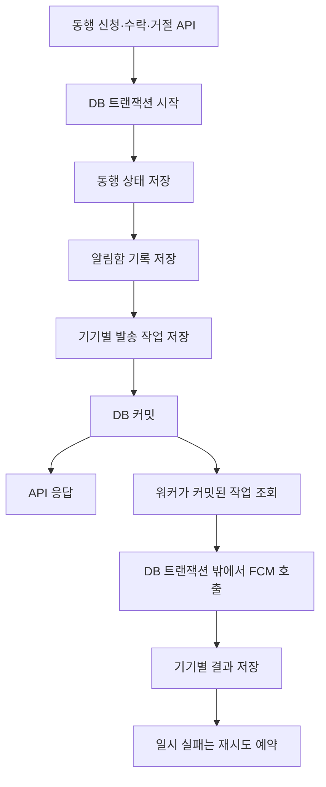

# ADR-03 동행 요청 푸시 알림 설계

## 상태

Accepted / Implementation in progress. 이슈 #205의 1차 구현을 반영하며, 실제 FCM 운영 전 검증이 필요한 항목은 아래 체크리스트에 남깁니다.

## 작성일과 기준

- 작성일: 2026-09-14.
- 기준: `develop`의 `2d3240d` 커밋.
- 작업 브랜치: `feat/205`.
- 관련 문서: [멀티 모듈 아키텍처](ADR-01-multimodule.md), [DB 설정](ADR-02-database-settings.md).

동행 신청·수락·거절에 기기 푸시를 도입하기 위한 설계와 1차 구현을 정리한다. 알림함 기록과 기기별 발송 작업을 같은 트랜잭션에서 저장하고, 별도 워커가 배치로 FCM을 호출하도록 구성했다. 로컬 프로필에서는 외부 호출을 로그 기반 성공 응답으로 대체하며, FCM 프로필은 Google Application Default Credentials를 사용한다.

**권장 방향은 동행 처리·알림함 기록·발송 작업을 하나의 DB 트랜잭션으로 저장하고, 별도 워커가 작은 묶음으로 푸시를 전송하는 것이다.**

| 관심사 | 적용 위치 | 목적 |
| --- | --- | --- |
| 비동기 | 외부 푸시 서비스 호출 | 외부 장애와 지연이 동행 API 응답에 전파되는 것을 줄인다. |
| 배치 | 대기 작업 조회·전송·결과 저장 | 제한된 자원으로 작업을 효율적으로 처리한다. |
| DB 인덱싱 | 알림 목록·미읽음·발송 대상 조회 | 데이터가 쌓여도 필요한 소량의 데이터에 빠르게 접근한다. |

## 목차

- [1. 범위와 수신 정책](#1-범위와-수신-정책)
- [2. 현재 Nearby 구현](#2-현재-nearby-구현)
- [3. 비동기 처리와 Transactional Outbox](#3-비동기-처리와-transactional-outbox)
- [4. 데이터 모델](#4-데이터-모델)
- [5. 워커의 작업 확보와 복구](#5-워커의-작업-확보와-복구)
- [6. 중복과 순서](#6-중복과-순서)
- [7. 짧은 주기의 배치 처리](#7-짧은-주기의-배치-처리)
- [8. 실패와 재시도 정책](#8-실패와-재시도-정책)
- [9. 조회와 DB 인덱스](#9-조회와-db-인덱스)
- [10. 모듈 배치와 Spring Modulith](#10-모듈-배치와-spring-modulith)
- [11. 앱 처리와 운영 검증](#11-앱-처리와-운영-검증)
- [12. 도입 순서와 결정할 사항](#12-도입-순서와-결정할-사항)
- [참고 자료](#참고-자료)

## 1. 범위와 수신 정책

모바일 기기 푸시까지 도입한다는 전제다. 앱이 열린 동안에만 배너를 표시하는 기능이라면 전송 채널은 달라질 수 있지만, 알림 저장과 비동기 작업 관리 원칙은 같다.

| 발생한 일 | 수신자 | 예시 문구 |
| --- | --- | --- |
| A가 B의 모집글에 신청한다. | 모집글 작성자 B | 새로운 동행 신청이 도착했어요. |
| B가 A의 신청을 수락한다. | 신청자 A | 동행 신청이 수락됐어요. |
| B가 A의 신청을 거절한다. | 신청자 A | 동행 신청 결과를 확인해 주세요. |

신청 직후 본인에게 보여줄 신청 완료 안내는 API 응답과 화면 메시지로 처리한다. 본인에게 별도의 푸시를 보낼지는 제품 정책으로 결정한다.

알림함은 사용자에게 발생한 사실을 보관하는 기록이고, 푸시는 그 기록의 존재를 알리는 전달 수단이다. 사용자가 푸시 권한을 거부해도 수락·거절 기록은 알림함에 남아야 한다.

```text
알림 생성 → 푸시 서비스 접수 → 기기 도착 → 화면 표시 → 사용자 읽음
```

각 단계는 별개의 상태다. 푸시 API 성공 시 알림을 읽음으로 바꾸지 않는다. `read_at`은 사용자의 명시적인 읽음 처리로 변경한다.

## 2. 현재 Nearby 구현

2026-09-14에 저장소에서 확인한 상태다.

| 구성 | 현재 동작 |
| --- | --- |
| `CreateCompanionRequestService` | 신청 저장 후 모집글 작성자에게 알림을 생성한다. |
| `ProcessCompanionRequestService` | 수락·거절 처리 후 신청자에게 알림을 생성한다. |
| `companion_notification` | 알림 종류·대상·수신자 조합의 유니크 제약과 읽음 시각을 가진다. |
| V9 마이그레이션 | `(recipient_user_id, created_at DESC)` 인덱스를 생성한다. |
| `CompanionNotificationQueryJpaRepository` | 보낸 요청·받은 요청의 알림을 여러 테이블과 조인하여 전체 `List`로 반환한다. |
| `adapter-out:notification` | 모듈이 이미 존재하며 휴대전화 인증 문자 발송을 구현한다. |
| Spring Modulith | JPA starter와 `event_publication` 테이블이 존재한다. |
| Supabase 연결 | PostgreSQL을 사용하며 HikariCP 최대 풀 크기 기본값은 5다. |
| 시간 기준 | `UtcTimeConfig`의 `Clock.systemUTC()`와 DB 세션 UTC 설정을 사용한다. V20에서 기존 서버 생성 업무 시간을 UTC로 보정했다. |

현재 신청·수락·거절은 알림 생성과 같은 트랜잭션으로 처리된다. 이 일관성을 유지하면서 기기 푸시 작업을 추가하는 것이 기본안이다.

관련 코드 위치는 [현재 코드 근거](#현재-코드-근거)에 모았다.

## 3. 비동기 처리와 Transactional Outbox

신청 API 내부에서 FCM을 호출하면 외부 응답을 기다리는 동안 API와 DB 트랜잭션이 길어진다. 푸시 발송 후 DB 커밋이 실패하면 실제로 존재하지 않는 신청에 대한 알림이 전달될 수도 있다.

커밋 후 `@Async` 호출만 사용해도 충분하지 않다. 커밋 직후 서버가 종료되면 메모리에만 있던 작업이 사라질 수 있다. Spring 공식 문서도 비동기 트랜잭션 이벤트 리스너만 사용할 때 이러한 유실 가능성을 설명한다. [Spring Modulith 이벤트 문서](https://docs.spring.io/spring-modulith/reference/1.4/events.html)

Transactional Outbox는 업무 변경과 외부로 전달할 작업을 같은 DB 트랜잭션에 저장하는 방식이다.



- 업무가 롤백되면 알림함과 발송 작업도 함께 롤백된다.
- 업무가 커밋되면 발송 작업이 DB에 남아 재시작 후에도 처리할 수 있다.
- FCM 장애 중에도 API는 외부 전송을 기다리지 않는다.
- 발송 작업의 DB 저장이 실패하면 동행 트랜잭션도 실패한다. 이는 업무 성공 시 전달 작업도 반드시 남긴다는 일관성을 선택한 결과다.

워커를 빠르게 깨우는 메모리 이벤트를 나중에 추가하더라도, 복구 기준은 DB의 대기 작업으로 유지한다.

## 4. 데이터 모델

사용자당 기기가 소수라는 전제에서 기존 알림 테이블에 기기 등록과 발송 작업 테이블을 추가했다. 아래 이름과 컬럼은 V21 1차 구현 기준이다.

| 테이블 | 한 행의 의미 | 주요 데이터 |
| --- | --- | --- |
| `companion_notification` | 사용자에게 발생한 알림 한 건 | 수신자, 알림 종류, 대상, 생성 시각, 읽음 시각 |
| `companion_push_endpoint` | 사용자의 앱 설치·푸시 수신 대상 한 개 | 사용자, 설치 식별자, 공급자 수신 주소, 플랫폼, 활성 상태 |
| `companion_push_delivery` | 알림 한 건을 기기 한 개에 전송할 작업 | 알림 ID, 기기 ID, 상태, 재시도 시각, 점유 정보 |

이 기본안에서는 `companion_push_delivery`가 Outbox 역할을 겸한다. 별도의 범용 이벤트 테이블을 추가할 필요는 없다.

### 기기별 작업 생성

신청 트랜잭션에서 수신자의 활성 기기를 조회하고 해당 기기별 작업을 생성한다. 기기가 두 개라면 알림함은 한 건, 발송 작업은 두 건이다.

```text
companion_push_delivery
  id
  notification_id
  endpoint_id
  recipient_user_id
  status
  attempt_count
  next_attempt_at
  lease_until
  claim_token
  last_error_code
  provider_message_id
  expires_at
  created_at
  updated_at
```

`UNIQUE(notification_id, endpoint_id)`로 같은 알림·기기의 발송 작업 중복 생성을 막는다.

### 기기 등록과 계정 전환

- 기기 등록 API는 인증된 사용자와 앱 설치를 연결한다.
- 공급자 수신 주소 갱신, 로그아웃, 계정 전환, 비활성화를 처리한다.
- 전송 직전 대기 작업의 수신자와 현재 기기의 소유자가 일치하는지 확인한다.
- 수신 대상이 변경될 수 있으므로 등록 버전 등으로 변경을 감지하는 방식을 검토한다.
- 공급자별 주소 형식과 SDK 타입은 푸시 어댑터 내부에 둔다.
- 페이로드에는 상세 개인정보를 최소화하고, 앱의 상세 조회에서 다시 권한을 검증한다.

등록된 기기가 없는 사용자는 알림함에만 기록한다. 이후 기기를 등록해도 과거 푸시를 모두 보내지 않는 것을 기본 정책으로 제안한다. 과거 미전송 알림도 전달해야 한다면 수신자 단위 작업을 먼저 저장하고 기기로 분배하는 단계를 추가한다.

이미 공급자에게 접수된 푸시는 로그아웃 시 서버가 완전히 회수할 수 없다. 앱은 현재 로그인 사용자와 대상의 접근 권한을 다시 확인하고, 잠금 화면에 표시되는 문구에는 개인 정보를 최소화한다. 전송 직전 소유자 확인과 계정 전환 사이의 경쟁 상황도 실제 기기 검증에 포함한다.

### UTC와 시간 타입

신규 발송 작업의 `next_attempt_at`, `lease_until`, `expires_at`, `created_at`, `updated_at`은 절대 시각이다. 1차 구현은 기존 Nearby의 UTC `Clock`·`LocalDateTime`·`timestamp` 저장 규칙을 따르고, 애플리케이션과 DB가 UTC를 사용하도록 유지한다. 향후 전체 시간 타입을 `Instant`·`timestamptz`로 전환할 때는 기존 업무 시간과의 호환성을 별도 검토한다.

기존 `companion_notification.created_at`과 `read_at`은 UTC 의미의 `timestamp`다. 이번 기능 때문에 기존 컬럼을 다시 시간 보정하거나 전체 업무 시간 타입을 변경하지 않는다. 기존 값을 `Instant`로 변환할 때 UTC로 해석하고, API의 새 커서 계약에는 UTC 의미와 정밀도를 명시한다.

기존 모임 예정 시각에는 현지 벽시각 의미가 포함될 수 있으므로 무조건 UTC로 간주해 만료 시각으로 복사하지 않는다. 동행의 도시·시간 유형과 현재 업무 규칙을 사용해 절대 시각으로 변환하는 정책을 확정한 후 `expires_at`을 결정한다.

## 5. 워커의 작업 확보와 복구

여러 서버가 같은 DB를 조회할 때 같은 작업을 동시에 처리하지 않도록 원자적으로 작업을 확보한다.

PostgreSQL의 `FOR UPDATE SKIP LOCKED`는 다른 워커가 잠근 행을 건너뛰고 다른 작업을 가져오는 데 사용할 수 있다. 공식 문서도 여러 소비자가 큐 형태의 테이블을 처리하는 용도를 설명한다. [PostgreSQL SELECT 문서](https://www.postgresql.org/docs/current/sql-select.html)

| 단계 | 트랜잭션 | 수행 내용 |
| --- | --- | --- |
| 작업 확보 | 짧은 트랜잭션 A | 실행 시각이 된 작업을 잠그고 `PROCESSING`, 점유 만료 시각, 새 `claim_token`을 기록한 뒤 커밋한다. |
| 전송 | DB 트랜잭션 밖 | FCM을 호출한다. |
| 결과 반영 | 짧은 트랜잭션 B | 현재 `claim_token`이 자신과 일치할 때만 결과를 갱신한다. |

FCM 응답을 기다리는 동안 DB 커넥션과 잠금을 유지하지 않는다. 현재 풀 크기 기본값이 5이므로 외부 통신 중 커넥션을 점유하면 동행 API 처리에도 영향을 줄 수 있다.

### 점유 만료와 늦은 응답

`lease_until`은 워커가 종료됐을 때 작업을 복구하기 위한 시각이다. 만료된 `PROCESSING` 작업은 다른 워커가 재확보하거나 재시도 상태로 되돌릴 수 있다.

이후 이전 워커가 늦게 돌아와 결과를 저장하려 해도 `claim_token`이 다르면 갱신하지 않는다. 이 조건은 이전 워커의 결과 덮어쓰기를 막지만, 이미 발생한 외부 전송 자체를 취소하지는 못한다.

점유 시간은 외부 호출 타임아웃과 실제 처리량을 고려해 정한다. 처리할 수 있는 양보다 많이 선점하면 전송 시작 전에 점유가 만료될 수 있으므로 가져올 작업 수에도 상한을 둔다.

### 작업 선점 SQL 예시

아래 문장은 새 테이블을 전제로 한 설계 예시다. 행 잠금과 상태 갱신을 같은 짧은 트랜잭션으로 실행한다. `:claimToken`은 이번 선점을 식별하는 새로운 값이며, 완료 갱신에는 작업 ID와 함께 사용한다.

```sql
WITH candidates AS (
    SELECT id
    FROM companion_push_delivery
    WHERE status IN ('PENDING', 'RETRY')
      AND next_attempt_at <= CURRENT_TIMESTAMP
      AND expires_at > CURRENT_TIMESTAMP
    ORDER BY next_attempt_at, id
    LIMIT :batchSize
    FOR UPDATE SKIP LOCKED
)
UPDATE companion_push_delivery AS delivery
SET status = 'PROCESSING',
    lease_until = CURRENT_TIMESTAMP
        + (:leaseSeconds * INTERVAL '1 second'),
    claim_token = :claimToken,
    attempt_count = delivery.attempt_count + 1,
    updated_at = CURRENT_TIMESTAMP
FROM candidates
WHERE delivery.id = candidates.id
RETURNING delivery.*;
```

여기서 `attempt_count`는 선점된 처리 시도 횟수이며 공급자의 실제 접수 횟수와 같지 않다. 결과 갱신은 `id`, `status = 'PROCESSING'`, `claim_token` 조건으로 수행한다. 만료된 대기 작업은 별도 제한된 정리 작업으로 `EXPIRED` 처리하여 조회에서 계속 남지 않게 한다.

Spring 프록시를 우회하는 같은 객체 내부 호출에 트랜잭션 분리를 의존하지 않는다. 선점·결과 저장 경계를 별도 빈이나 명시적인 트랜잭션 실행으로 보장하며, 워커 전체를 하나의 `@Transactional` 메서드로 감싸지 않는다.

## 6. 중복과 순서

DB의 유니크 제약만으로 외부 푸시를 정확히 한 번 전송한다고 보장할 수는 없다.

```text
FCM이 요청을 접수한다.
→ 서버가 성공 결과를 저장하기 전에 종료된다.
→ 복구 워커가 같은 작업을 다시 전송한다.
```

설계 목표는 재처리 가능성을 확보하고 중복의 영향을 줄이는 것이다.

| 위치 | 중복 대응 |
| --- | --- |
| 알림함 | 알림 종류·대상·수신자 유니크 제약을 사용한다. |
| 발송 작업 | 알림·기기 유니크 제약을 사용한다. |
| 재전송 페이로드 | 최초 `notificationId`를 유지한다. |
| 앱 | `notificationId`로 같은 알림을 식별하고, 상세 진입 시 최신 상태를 조회한다. |

앱의 중복 처리만으로 운영체제가 자동 표시하는 푸시까지 완전히 제어한다고 보장하지 않는다. 표시 방식에 따른 플랫폼 동작도 검증해야 한다.

여러 워커와 재시도 때문에 전송 순서가 바뀔 수 있다. 늦게 도착한 신청 알림이 최신 수락 상태를 되돌리지 않도록 앱은 푸시 페이로드를 현재 업무 상태의 기준으로 사용하지 않는다. 이미 처리된 신청에 대한 지연 푸시를 생략할지도 정책으로 정한다.

### 기존 중복 저장 코드의 확인 사항

현재 `CompanionNotificationRepositoryAdapter`는 유니크 충돌 예외를 잡고 재조회한다. PostgreSQL에서는 제약 위반으로 현재 트랜잭션이 실패 상태가 될 수 있어, 같은 트랜잭션 안에서 예외를 잡고 재조회하는 방식만으로 안전성을 확보하기 어렵다.

신규 작업 생성에는 `INSERT ... ON CONFLICT`처럼 충돌을 정상 경로로 처리하는 방법을 검토한다. 기존 알림 저장도 실제 PostgreSQL 동시성 테스트로 확인한다.

## 7. 짧은 주기의 배치 처리

동행 신청은 빠른 반응을 기대하는 기능이다. 수백 건이 쌓이거나 몇 분이 지나기를 기다리는 방식은 적합하지 않다.

| 배치 종류 | 처리 방법 |
| --- | --- |
| 작업 조회 | 실행 가능한 작업을 제한된 개수만 조회한다. |
| 전송 | 메시지 목록을 SDK에 전달하고 기기별 결과를 확인한다. |
| 결과 저장 | 결과를 모아 짧은 트랜잭션에서 반영한다. |

초기 설정 예시는 1초마다 최대 50건을 가져오는 것이다. 한 건만 있어도 처리하며, 실제 전송 동시성도 제한한다. 이 숫자는 검증된 운영값이 아니며 지연과 DB 부하를 측정해 조정한다.

FCM Admin SDK는 최대 500개 메시지의 목록 전송을 지원한다. 개인별 알림은 각각의 메시지로 구성하고 기기별 결과를 확인한다. 목록 호출을 하나의 원자적 전송이나 단 한 번의 네트워크 요청으로 가정하지 않는다. [Firebase 전송 문서](https://firebase.google.com/docs/cloud-messaging/send/admin-sdk)

50개 중 47개가 성공하고 3개가 실패하면 실패한 3개만 재시도한다. 전체 묶음을 다시 보내지 않는다.

`saveAll()`이 실제 SQL 배치를 보장하지는 않는다. IDENTITY 키와 개별 `flush`는 기대한 묶음 처리를 제한할 수 있다. 실제 SQL을 확인한 후 필요한 곳에 JDBC 배치나 다중 행 INSERT를 적용한다.

초기 전송 워커에 Spring Batch까지 도입할 필요는 크지 않다. 오래된 완료 작업 정리, 대규모 재처리처럼 실행 이력·재시작·청크 관리가 필요한 작업이 생기면 검토한다.

## 8. 실패와 재시도 정책

```text
PENDING → PROCESSING → SENT
                    → RETRY
                    → FAILED_PERMANENT
                    → EXPIRED
                    → SKIPPED
```

`SENT`는 공급자가 요청을 접수했다는 뜻이다. 사용자에게 표시되거나 읽혔다는 의미가 아니다.

| 상황 | 처리 |
| --- | --- |
| 일시적인 네트워크 오류·서비스 장애 | 재시도 시각을 저장한다. |
| 호출 제한 | 공급자 제한과 `Retry-After`를 반영한다. |
| 폐기된 수신 대상 | 해당 등록을 비활성화하고 작업을 종료한다. |
| 잘못된 페이로드 | 원인을 기록하고 무한 재시도를 막는다. |
| 서버 인증·설정 오류 | 운영 경보와 반복 호출 제한을 적용한다. |
| 유효기간 종료 | `EXPIRED`로 종료한다. |
| 계정 전환·수신 설정 변경 | 정책에 따라 `SKIPPED`로 종료한다. |

재시도는 지수 백오프와 무작위 지연을 사용하고 `next_attempt_at`에 다음 실행 시각을 저장한다. 스레드를 오래 재워 대기하지 않는다. 최대 시도 횟수와 작업 유효기간을 정하고, 종료된 실패 작업의 원인과 재처리 이력을 남긴다.

FCM은 오류별 재시도 정책을 안내하며, 할당량 초과에는 최소 1분의 초기 지연을 요구하는 경우도 있다. 모든 오류에 동일한 재시도 간격을 적용하지 않는다. [FCM 오류 코드 문서](https://firebase.google.com/docs/cloud-messaging/error-codes)

이미 종료된 모임의 신청 알림이 다음 날 전달되지 않도록 작업의 `expires_at`과 푸시 메시지의 TTL을 함께 정한다. 일시 실패 후 발송할 때도 업무 상태와 유효기간을 확인한다.

## 9. 조회와 DB 인덱스

인덱스는 실제 조회 조건과 정렬 순서에 맞춰 설계한다. 현재 목록은 전체 `List`를 반환하므로 페이지 크기 제한과 커서 페이지네이션이 우선이다.

알림 목록 SQL은 설계 예시다. 발송 작업 인덱스는 V21 마이그레이션에 반영했으며, PostgreSQL 부분 인덱스 전환 여부는 운영 데이터로 추가 검증한다.

### 알림 목록과 커서

현재 V9 인덱스를 확장하는 기본 후보는 다음과 같다.

```sql
CREATE INDEX idx_notification_recipient_cursor
ON companion_notification
    (recipient_user_id, created_at DESC, id DESC);
```

```sql
SELECT id, notification_type, target_id, created_at, read_at
FROM companion_notification
WHERE recipient_user_id = :userId
  AND (created_at, id) < (:cursorCreatedAt, :cursorId)
ORDER BY created_at DESC, id DESC
LIMIT 21;
```

첫 페이지에서는 커서 조건을 생략한다. 20건 표시 기준으로 한 건을 더 가져와 다음 페이지 존재 여부를 판단한다. `id`까지 정렬에 넣어 생성 시각이 같은 알림에도 일정한 순서를 만든다.

실제 구현에는 현재 보낸 요청·받은 요청 필터와 필요한 조인을 유지해야 한다. 방향별 필터로 너무 많은 행을 걸러내는 문제가 실행 계획에서 확인되면 해당 알림 종류만 포함하는 부분 인덱스를 검토한다.

### 미읽음 표시

```sql
CREATE INDEX idx_notification_unread_recipient
ON companion_notification (recipient_user_id)
WHERE read_at IS NULL;
```

빨간 점만 필요하면 `EXISTS`로 존재 여부를 확인한다. 정확한 개수가 필요할 때 `COUNT`를 사용한다. 알림의 읽음 처리에는 본인 수신자 조건을 유지한다.

### 발송 대기 작업과 점유 복구

```sql
CREATE INDEX idx_companion_push_delivery_due
ON companion_push_delivery (status, next_attempt_at, id);

CREATE INDEX idx_companion_push_delivery_expired_lease
ON companion_push_delivery (status, lease_until, id);

CREATE INDEX idx_companion_push_delivery_expiration
ON companion_push_delivery (status, expires_at, id);
```

완료 작업이 쌓여도 활성 작업 위주로 탐색하는 목적이다. `next_attempt_at <= now()`는 조회 조건에 넣고, 시간에 따라 달라지는 `now()`를 부분 인덱스 조건에 넣지는 않는다. 쿼리 조건이 인덱스 조건과 맞아야 실제 사용될 수 있다. [PostgreSQL 부분 인덱스 문서](https://www.postgresql.org/docs/current/indexes-partial.html)

### 추가 확인 사항

- 활성 기기 조회는 사용자별 조회 조건에 맞는 인덱스를 검토한다.
- 현재 알림 목록의 `companion_match_participant.accepted_application_id` 조인도 실행 계획에서 확인한다. 외래키가 있다고 참조하는 쪽의 조회 인덱스가 자동 생성되는 것은 아니다.
- 기존 V9 인덱스와 새 인덱스의 중복 유지 여부를 검토한다.
- 인덱스가 늘면 쓰기와 상태 변경 비용도 늘므로 모든 조합을 미리 만들지 않는다.
- 완료된 발송 작업을 보존 정책에 따라 정리하고, 상태 변경이 많은 테이블의 크기와 vacuum 상태를 관찰한다.
- 운영과 비슷한 데이터 분포에서 `EXPLAIN (ANALYZE, BUFFERS)`로 효과를 확인한다. 실제 실행을 수반하므로 변경 쿼리 검증은 격리된 환경에서 수행한다.

## 10. 모듈 배치와 Spring Modulith

| 위치 | 책임 |
| --- | --- |
| `application` | 알림 정책, 작업 생성·처리 유스케이스, 저장소·푸시 발송 포트 |
| `adapter-out:persistence` | 기기와 작업 저장, 선점 SQL, 마이그레이션 |
| `adapter-out:notification` | FCM SDK 호출, 공급자 응답을 내부 결과로 변환 |
| `adapter-in:web` | 기기 등록·해제, 알림 조회·읽음 API |
| 필요 시 `adapter-in:worker` | 스케줄러가 발송 처리 유스케이스를 호출하는 진입점 |
| `bootstrap` | 워커 활성화, 실행기·SDK·설정 조립 |

`application`은 FCM의 `Message`나 JPA 엔티티를 알지 않도록 유지한다. `bootstrap`에는 전송 정책이나 처리 로직을 넣지 않는다. 기존 동행 관련 구현은 같은 최상위 기능 패키지 아래에 두고, 다른 기능과의 협력은 의도된 공개 포트나 이벤트를 사용한다.

동행 알림 정책과 발송 작업은 우선 `companion` 기능에 둔다. 사용자·로그아웃과 결합되는 기기 등록은 `user` 기능이 소유하고, 동행은 의도적으로 공개한 기기 조회 계약을 통해 협력하는 것을 제안한다. 다른 기능의 저장소나 JPA 엔티티를 직접 참조하지 않으며, 아직 존재하지 않는 범용 알림 플랫폼을 `common`에 만들지 않는다.

### Spring Modulith를 사용할 경우

현재 JPA starter와 `event_publication` 테이블이 존재한다. Event Publication Registry는 업무 트랜잭션에 이벤트 전달 기록을 저장하고 미완료 이벤트의 재처리를 지원한다. 의존성과 테이블의 존재만으로 현재 알림이 영속 이벤트로 전달되는 것은 아니며, 이벤트 발행·리스너·재처리 구성이 필요하다. [Spring Modulith 1.4 문서](https://docs.spring.io/spring-modulith/reference/1.4/events.html)

기기별 실패, 다음 재시도 시각, 점유 만료 등 푸시 전송 상태는 별도로 관리해야 한다. 초기에는 직접 `companion_push_delivery`를 저장하는 방식이 단순하다. 여러 기능이 같은 이벤트를 구독하게 되면 Modulith 이벤트 리스너가 발송 작업을 생성하는 구조를 검토한다.

이때 이벤트 전달 재시도와 실제 푸시 전송 재시도의 책임을 구분한다. 리스너는 기기별 발송 작업을 멱등하게 생성하고, 푸시 워커가 외부 전송을 담당하도록 구성할 수 있다.

## 11. 앱 처리와 운영 검증

### HTTP 계약

푸시 수신 대상 등록·해제 경로는 1차 구현에서 다음 계약으로 확정했다. 기존 알림 목록 API의 커서 전환은 별도 작업으로 남긴다.

| API | 계약 |
| --- | --- |
| `POST /api/users/me/push-endpoints` | 인증된 사용자에 대해 `installationId`, `token`, `platform`을 받아 설치별 수신 대상을 멱등하게 등록·갱신한다. 사용자 ID를 요청 본문에서 신뢰하지 않는다. |
| `DELETE /api/users/me/push-endpoints/{installationId}` | 본인에게 연결된 설치만 비활성화한다. 이미 해제된 경우도 멱등하게 처리한다. |
| `GET /api/users/me/companion-requests` | 기존 `direction`을 유지하고 선택적 `cursor`, `size`를 추가한다. 기존 `direction`, `requests` 응답 필드를 유지하면서 `nextCursor`, `hasNext` 추가를 제안한다. |
| `PATCH /api/users/me/companion-requests/{notificationId}/read` | 기존 본인 알림 읽음 처리를 유지한다. 푸시 전송 결과와 연결하지 않는다. |

커서는 생성 시각·ID·조회 방향을 포함하는 불투명 문자열로 구성할 수 있다. 잘못된 커서와 허용 범위를 벗어난 페이지 크기는 입력 오류로 처리하고, 사용자 ID는 항상 인증 정보에서 얻는다. 정렬 시각은 DB 정밀도를 보존한다.

기존 앱은 전체 목록을 받는다고 가정할 수 있으므로, 페이지 제한 도입은 응답 필드 추가만으로 호환된다고 판단하지 않는다. 앱의 다음 페이지 조회 지원과 맞춰 출시하거나, 기존 클라이언트를 위한 별도 호환 경로를 유지한다. 미읽음 조회 API는 배지 요구가 확정되면 별도로 정의한다.

### 앱의 처리

- 푸시의 `notificationId`와 대상 식별자로 화면에 진입한다.
- 상세 진입 시 서버에서 최신 동행 상태와 접근 권한을 확인한다.
- 앱 전경에서는 수신 콜백을 통해 배너와 목록 갱신 동작을 정한다.
- 백그라운드·권한 거부·앱 재실행에서는 플랫폼 동작과 알림함 동기화를 확인한다.
- 푸시 수신이나 공급자 접수를 읽음 처리로 연결하지 않는다.

FCM 메시지는 전경·백그라운드 상태에 따라 표시와 콜백 동작이 달라진다. 서버 전송 성공과 실제 앱 표시 성공은 별도로 검증한다. [Firebase 메시지 유형 문서](https://firebase.google.com/docs/cloud-messaging/customize-messages/set-message-type)

### 구현 후 확인할 시나리오

- [x] 알림 생성 시 활성 기기별 발송 작업을 생성하고, 작업 생성 유니크 충돌을 멱등하게 처리한다.
- [x] 배치 워커가 `FOR UPDATE SKIP LOCKED` 방식으로 작업을 확보하고 성공·재시도·영구 실패 결과를 반영한다.
- [x] 점유 만료·작업 만료·비활성 기기 작업을 다음 배치에서 복구·종료한다.
- [ ] 업무 롤백 시 알림과 발송 작업도 롤백된다.
- [ ] 커밋 직후 서버가 종료되어도 재시작 후 작업을 처리한다.
- [ ] 두 워커가 같은 작업을 동시에 선점하지 않는다.
- [ ] 점유 만료 후 복구되며 이전 워커의 늦은 결과가 덮어쓰지 않는다.
- [ ] FCM 접수 후 결과 저장 실패 시 재처리와 중복 대응이 동작한다.
- [ ] 여러 기기 중 실패한 기기만 재시도한다.
- [ ] 로그아웃·계정 전환 후 이전 사용자의 대기 알림을 차단한다.
- [ ] 업무가 만료되거나 이미 처리된 경우 지연 푸시 정책이 적용된다.
- [ ] 대량 알림이 있는 사용자의 커서·미읽음 조회를 확인한다.
- [ ] 실제 기기에서 전경·백그라운드·권한 거부·푸시 클릭을 확인한다.
- [ ] 선점·유니크 충돌 등 DB 동작은 실제 PostgreSQL에서 검증한다.

현재 코드 수준에서는 `application`, `adapter-out:persistence`, `adapter-out:notification`, `adapter-in:web`, `bootstrap`의 관련 테스트와 애플리케이션 컨텍스트 초기화를 통과했다. 실제 PostgreSQL 선점 경쟁, FCM 접수, 모바일 전경·백그라운드 표시, 운영 부하 검증은 배포 전 수행한다.

### 운영 지표

| 지표 | 판단할 내용 |
| --- | --- |
| 가장 오래 대기 중인 작업의 나이 | 워커가 멈췄거나 밀리고 있는지 확인한다. |
| 생성부터 공급자 접수까지의 지연 | 사용자에게 알림을 빠르게 전달하고 있는지 추적한다. |
| 재시도·영구 실패·만료 수 | 공급자 장애, 등록 문제, 과도한 지연을 구분한다. |
| 처리량과 실행 중 작업 수 | 묶음 크기와 동시성의 적정성을 확인한다. |
| DB 커넥션 대기와 조회 시간 | 푸시 처리가 업무 API에 영향을 주는지 확인한다. |

공급자 접수율과 실제 기기 도착·표시·읽음은 다른 지표다. 기기 측 관측이 필요하다면 별도의 수집 방식을 설계한다.

기존 monitoring 프로필의 Prometheus 수집 경로를 활용하고, 사용자 ID·기기 주소·알림 ID를 메트릭 라벨로 사용하지 않는다. 오류 로그에도 수신 주소와 인증 정보를 원문으로 남기지 않는다.

## 12. 도입 순서와 결정할 사항

1. 신청·수락·거절의 수신자, 유효기간, 기기 없는 사용자 처리 정책을 정한다.
2. 기존 알림 저장과 같은 트랜잭션에서 기기별 발송 작업을 저장한다.
3. 작업 확보·외부 전송·결과 반영을 분리한 워커를 구현한다.
4. 기기별 재시도, 점유 만료 복구, 멱등성을 구현한다.
5. 알림 목록을 커서 방식으로 바꾸고 실제 쿼리에 맞춰 인덱스를 검증한다.
6. 장애·동시성·실제 기기 시나리오와 운영 지표를 확인한다.
7. 측정 결과에 따라 묶음 크기와 동시성을 조정한다.

브로커 도입과 별도 워커 프로세스 분리는 측정된 처리량·지연·장애 격리 요구를 근거로 판단한다. 초기부터 추가 인프라를 필수로 두지는 않는다.

결정이 필요한 제품 정책은 다음과 같다.

- 앱 내 배너와 기기 푸시의 표시 범위.
- 본인이 신청한 직후 본인에게도 푸시를 보낼지 여부.
- 알림 종류별 유효기간과 최대 재시도 횟수.
- 이미 수락·거절된 신청에 대한 지연 푸시 생략 여부.
- 여러 기기로 모두 전송할지 여부.
- 읽음 처리의 기준과 미읽음 배지의 형태.
- 완료·실패 작업과 알림함 기록의 보존 기간.

## 참고 자료

### 공식 문서

- [Spring Modulith 1.4 — Working with Application Events](https://docs.spring.io/spring-modulith/reference/1.4/events.html)
- [PostgreSQL — SELECT와 SKIP LOCKED](https://www.postgresql.org/docs/current/sql-select.html)
- [PostgreSQL — Partial Indexes](https://www.postgresql.org/docs/current/indexes-partial.html)
- [Firebase — Admin SDK 메시지 전송](https://firebase.google.com/docs/cloud-messaging/send/admin-sdk)
- [Firebase — FCM 오류 코드](https://firebase.google.com/docs/cloud-messaging/error-codes)
- [Firebase — 메시지 유형과 앱 상태별 동작](https://firebase.google.com/docs/cloud-messaging/customize-messages/set-message-type)

### 현재 코드 근거

아래 링크는 이 문서 위치에서 저장소 파일을 참조하는 상대 경로다.

- [신청 생성 서비스](../../application/src/main/java/com/sopt/nearby/companion/application/CreateCompanionRequestService.java)
- [신청 수락·거절 서비스](../../application/src/main/java/com/sopt/nearby/companion/application/ProcessCompanionRequestService.java)
- [알림 생성 서비스](../../application/src/main/java/com/sopt/nearby/companion/application/CreateCompanionNotificationService.java)
- [푸시 발송 워커 서비스](../../application/src/main/java/com/sopt/nearby/companion/application/ProcessCompanionPushDeliveriesService.java)
- [푸시 수신 대상 등록 API](../../adapter-in/web/src/main/java/com/sopt/nearby/companion/adapter/in/web/controller/CompanionPushEndpointController.java)
- [푸시 발송 작업 저장소](../../adapter-out/persistence/src/main/java/com/sopt/nearby/companion/adapter/out/persistence/CompanionPushDeliveryRepositoryAdapter.java)
- [푸시 발송 어댑터](../../adapter-out/notification/src/main/java/com/sopt/nearby/companion/adapter/out/notification/FirebasePushSender.java)
- [푸시 테이블 V21](../../adapter-out/persistence/src/main/resources/db/migration/V21__create_companion_push_delivery.sql)
- [알림 저장 어댑터](../../adapter-out/persistence/src/main/java/com/sopt/nearby/companion/adapter/out/persistence/CompanionNotificationRepositoryAdapter.java)
- [알림 목록 쿼리](../../adapter-out/persistence/src/main/java/com/sopt/nearby/companion/adapter/out/persistence/repository/CompanionNotificationQueryJpaRepository.java)
- [알림 테이블 V8](../../adapter-out/persistence/src/main/resources/db/migration/V8__create_companion_notification.sql)
- [알림 목록 인덱스 V9](../../adapter-out/persistence/src/main/resources/db/migration/V9__add_notification_list_indexes.sql)
- [Supabase 연결 설정](../../bootstrap/src/main/resources/application-supabase.yaml)
- [UTC Clock 설정](../../bootstrap/src/main/java/com/sopt/nearby/shared/config/UtcTimeConfig.java)
- [기존 업무 시간 UTC 보정 V20](../../adapter-out/persistence/src/main/resources/db/migration/V20__normalize_business_timestamps_to_utc.sql)
- [기존 알림 목록 응답](../../adapter-in/web/src/main/java/com/sopt/nearby/companion/adapter/in/web/dto/response/CompanionNotificationsResponse.java)
- [Prometheus 모니터링 설정](../../bootstrap/src/main/resources/application-monitoring.yml)

워커의 기본 설정값은 `1초·50건·최대 5회·점유 30초`이며 운영 부하 측정으로 조정한다. V21 인덱스는 H2 테스트와 PostgreSQL 호환성을 위해 일반 복합 인덱스로 적용했고, 실제 실행 계획을 확인한 뒤 부분 인덱스로 바꿀 수 있다. 이 문서는 FCM 실제 전송·모바일 표시·부하·배포 결과를 의미하지 않는다.
